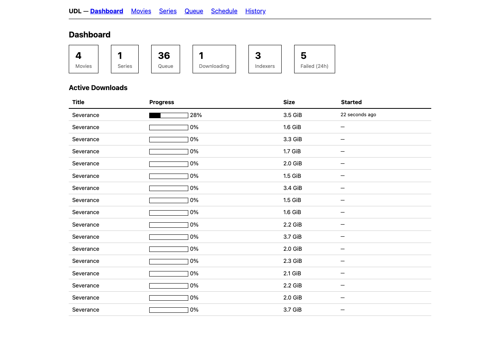

# UDL — Usenet Download Layer

A single Go binary that replaces Sonarr + Radarr + NZBGet for Usenet-based media
automation. CLI-first, daemon mode, opinionated defaults.

## Install

```bash
go build -o udl ./cmd/udl
```

Requires `par2cmdline` for PAR2 verify/repair:

```bash
brew install par2cmdline
```

## Usage

```bash
./udl daemon                   # start daemon (foreground)
./udl status                   # check daemon status

./udl movie add "Title"        # add movie to wanted list
./udl movie search "Title"     # search indexers
./udl movie list               # list movies
./udl movie remove "Title"     # remove movie

./udl tv add "Title"           # add TV series
./udl tv list                  # list series
./udl tv remove "Title"        # remove series

./udl queue                    # show download queue
./udl queue retry [id]         # retry failed download
./udl history                  # show download history
./udl blocklist                # show blocklisted releases
./udl blocklist clear          # clear all blocklist entries
./udl blocklist remove <id>    # remove specific entry

./udl library import <dir>              # identify and import media (dry-run)
./udl library import <dir> --execute    # actually perform the import
./udl library cleanup                   # find orphan/misnamed files (dry-run)
./udl library cleanup --execute         # rename misnamed, delete orphans
./udl library verify                    # read-only DB/disk consistency check
./udl library prune-incomplete          # find stale download dirs (dry-run)

./udl plex servers             # list Plex friend servers
./udl plex check "Title"       # check if friends have it
./udl plex cleanup             # show unwatched old media (dry-run)
./udl plex cleanup --execute   # delete unwatched media older than 90 days
./udl plex cleanup --days 30   # shorter age threshold
```

## Web UI

Enable the optional web dashboard by adding a `[web]` section to config:

```toml
[web]
port = 9876
bind = "127.0.0.1"
```

The dashboard shows library stats, active downloads with live progress (via SSE), queue status, series schedule, and download history. Navigation: Dashboard, Movies, Series, Queue, Schedule, History.



Pages use htmx for dynamic updates — the queue refreshes automatically via server-sent events.

## Plex Cleanup

Reclaim disk space by deleting media that was never watched on your Plex server. Queries your owned Plex server's watch history and identifies items added more than N days ago with zero plays.

```bash
./udl plex cleanup                 # dry-run — shows what would be deleted
./udl plex cleanup --days 30       # items older than 30 days (default: 90)
./udl plex cleanup --execute       # actually delete files and reset to "wanted"
./udl plex cleanup --verbose       # also show kept items with reasons
```

Output:
```
ACTION  TYPE    TITLE                QUALITY       AGE   SIZE
delete  movie   Late Night (2024)    WEBDL-1080p   120d  4.2 GB
delete  series  The Bear (2022)      WEBDL-1080p   95d   18.7 GB
keep    movie   Dune Part Two (2024) WEBDL-1080p   45d   — (too recent)
keep    series  Severance (2022)     WEBDL-1080p   60d   — (watched)

would delete 2 items (22.9 GB), keep 2 — use --execute to apply
```

On `--execute`: files are deleted, database status is reset to "wanted" (so they can be re-grabbed later if needed), and a "cleaned" history event is recorded. Empty directories are cleaned up automatically. Requires `[plex] token` in config.

## Configuration

Single config file at `~/.config/udl/config.toml`:

```toml
[library]
movies = "/path/to/movies"
tv = "/path/to/tv"

[paths]
incomplete = "/path/to/downloads/incomplete"
complete = "/path/to/downloads/complete"

[quality]
profile = "1080p"   # 720p, 1080p, 4k, remux

[tmdb]
apikey = "your-tmdb-api-key"

[[usenet.providers]]
name = "primary"
host = "news.example.com"
port = 563
tls = true
username = "user"
password = "pass"
connections = 30

[[indexers]]
name = "MyIndexer"
url = "https://indexer.example.com"
apikey = "key"

[plex]
token = "your-plex-token"  # optional, enables friend library checking + cleanup

[web]
port = 9876          # optional, enables web dashboard
bind = "127.0.0.1"   # default: localhost only
```

## Library Import

UDL can scan an existing media directory, identify files via TMDB, and import them
into the library with canonical naming. Handles edge cases that trip up simpler parsers:

- **Year-in-title movies**: `2001.A.Space.Odyssey.1968.1080p.BluRay` → title="2001 A Space Odyssey", year=1968
- **Edition tags**: `Blade.Runner.The.Final.Cut.1982.1080p.BluRay` → title="Blade Runner", edition="The Final Cut"
- **Noise tokens**: `Movie.PROPER.REPACK.2024.1080p.WEB-DL` → title="Movie"
- **Year-as-season** (Plex annual shows): `S2024E02` → season=2024, episode=2
- **Diacritic folding**: Shōgun → Shogun, Fóstbræður → Fostbraedur (ð→d, þ→th, æ→ae, ō→o)
- **Fuzzy year matching**: accepts ±1 year offset between release and TMDB (production vs release year)

Tested against a real Plex library: 104/107 movies and 1067/1072 TV episodes identified
correctly. Remaining gaps are TMDB coverage issues, not parser failures.

## File Naming

Hardcoded, Plex-compatible. Folders use spaces (human-readable), filenames use dots (scene-style).

**Movies:**
```
{library}/Movie Title (Year)/Movie.Title.Year.Quality.ext
```
Example:
```
movies/Die Hard (1988)/Die.Hard.1988.Bluray-1080p.mkv
movies/Dune Part Two (2024)/Dune.Part.Two.2024.WEBDL-1080p.mkv
```

**TV:**
```
{library}/Show Name (Year)/Season 01/Show.Name.S01E01.Episode.Title.Quality.ext
```
Example:
```
tv/The Bear (2022)/Season 01/The.Bear.S01E01.System.WEBDL-1080p.mkv
tv/Severance (2022)/Season 02/Severance.S02E01.Hello.Ms.Cobel.WEBDL-1080p.mkv
```

Quality tags: `SDTV`, `HDTV-720p`, `WEBDL-1080p`, `Bluray-1080p`, `WEBDL-2160p`, `Bluray-2160p`, `Remux-1080p`, `Remux-2160p`.

No configurable naming templates. This is the way.

## Download Pipeline

```
Search indexers → Score & filter releases → Fetch NZB
  → NNTP segment download (connection pooling, retry, backoff)
  → yEnc decode → PAR2 verify/repair → RAR extract
  → Magic byte detection (handles obfuscated filenames)
  → Import to library with canonical naming
```

Failed downloads are automatically blocklisted so re-search picks a different release.
Stuck downloads (>2h) are auto-reset. Disk space is checked before starting (2x + 1GB).

## Testing

```bash
go test ./... -count=1                            # all tests
go test ./internal/parser/ -v                     # parser edge cases
go test ./internal/daemon/ -run TestPipeline -v   # integration tests
go test ./internal/daemon/ -run TestLibrary -v    # library management tests
```

## Architecture

- **Single binary**, single config (`~/.config/udl/config.toml`), single SQLite database (`~/.config/udl/udl.db`)
- **CLI ↔ Daemon** via `net/rpc` over Unix socket
- **Scheduler** runs RSS sync (every 15m) and search sweeps (every 6h)
- **Plex integration** checks friend libraries before downloading (optional)
- **Quality profiles:** 720p, 1080p (default), 4k, remux — each with min/preferred/upgrade tiers

## Design Principles

- Usenet only — no torrents
- Optional web dashboard — CLI is the primary interface
- No custom naming templates
- Minimal config surface — provider credentials, indexer keys, library paths
- Failed releases are blocklisted, not retried
- Atomic file imports (write to tmp, fsync, rename)
